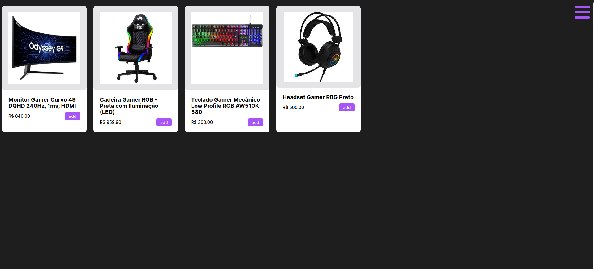
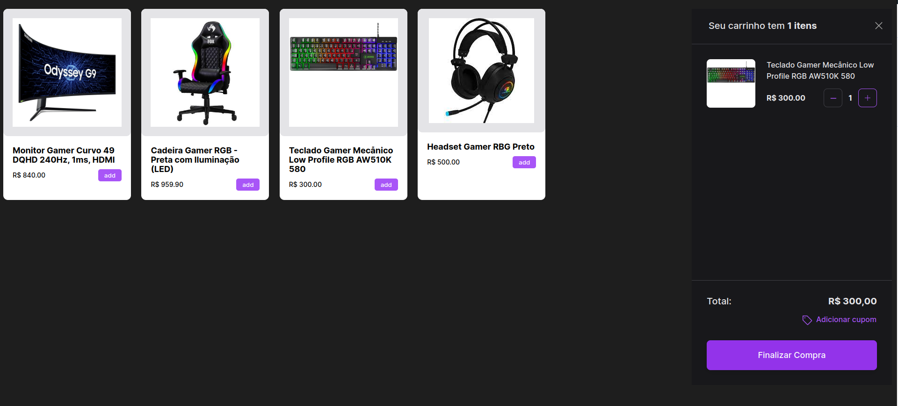

<h1 align="center"> Carrinho de Compras </h1>

Um carrinho de compras feito no #BoraCodar (Não está responsivo e em telas menores pode quebrar o layout)

  <a href="#-tecnologias">Tecnologias</a>&nbsp;&nbsp;&nbsp;|&nbsp;&nbsp;&nbsp;
  <a href="#-projeto">Projeto</a>&nbsp;&nbsp;&nbsp;|&nbsp;&nbsp;&nbsp;
  <a href="#-layout">Layout</a>&nbsp;&nbsp;&nbsp;|&nbsp;&nbsp;&nbsp;
  <a href="#memo-licença">Licença</a>

  

 

  

  

## 🚀 Tecnologias

Esse projeto foi desenvolvido com as seguintes tecnologias:

# Frond-end
- React
- Typescript
- Axios
- Phosphor React
- Styled-Components

# Back-end
- Fastify
- Typescript
- HTML e CSS

## 💻 Projeto
Carrinho de compra feito com React e Styled-Components, era somente a parte do HTML e CSS porém dei um encrementada no projeto

## 🔖 Layout

Você pode visualizar o layout do projeto através [DESSE LINK](https://www.figma.com/file/TD6GtpFP6qgMr02VTEWUd2/Carrinho-de-compras-%E2%80%A2-Desafio-21-(Community)?type=design&node-id=0-1&t=dZaH45DUqZh3cBXX-0). É necessário ter conta no [Figma](https://figma.com) para acessá-lo.

## :memo: Licença

Esse projeto está sob a licença MIT.

---